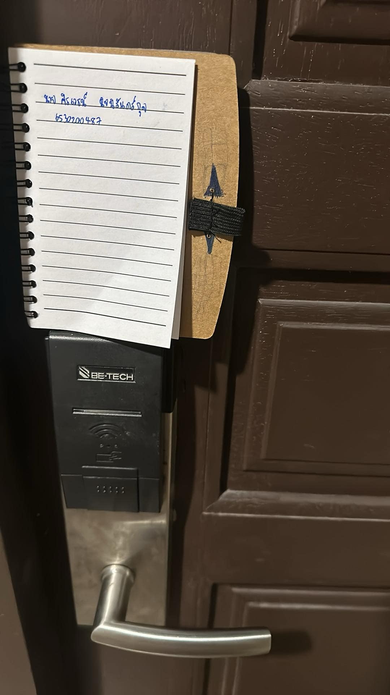

**Example of Security Controls in Daily Life**

**Keycard door lock (ระบบล็อกประตูด้วยคีย์การ์ด)**

**📍 Location**

**สถานที่: บ้านสุขสบาย หอพักแถว มหาวิทยาลัยเกษตรศาสตร์ วิทยาเขตศรีราชา**

**กฏในการเข้าห้องของหอพักคือการได้รับคีย์การ์ดมาเเล้วนำมาเเต้มเครื่องเพื่อเข้าห้อง โดยเมื่อปิดประตูประตูจะล๊อคโดยอัติโนมัติ**

**🔒 Types of Security Controls**  
: **Physical Controls**

**🛡️ Control Functions**  
: **Preventative**
